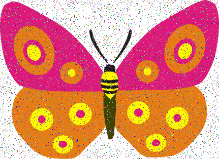
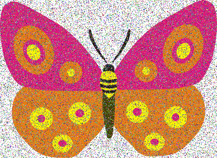
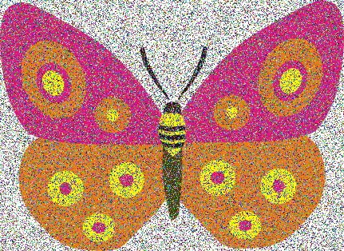

# Exercice 2

Il faut ajouter du bruit à une image. Le bruit sur une image est des pixels détériorés dans l'image. Par définition, la couleur du pixel détériorés est aléatoire.

## Exemple

|Original|10% de bruit|
|--------|------------|
|||

|30% de bruit|50% de bruit|
|------------|------------|
|||